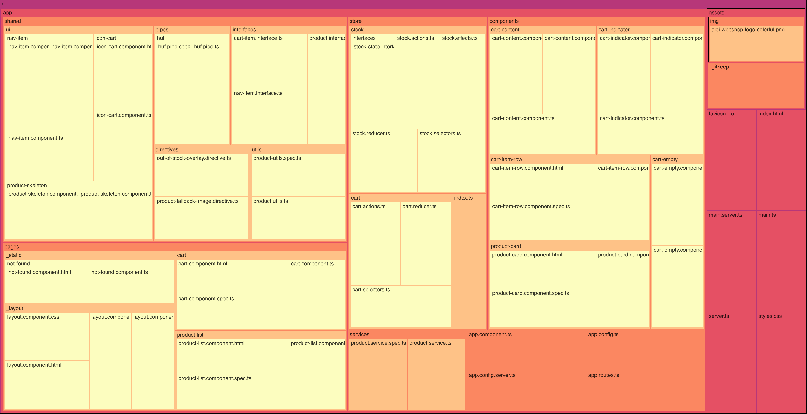

# ALDI e-commerce application

A modern e-commerce application demo built with Angular 19, featuring a product list and a shopping cart using NgRx for state management.

## ✅ Acceptance criteria

- [x] Create two different pages /products and /cart
- [x] The Product page lists all products and their information, and enables adding each individual product to cart in various amounts, with respect to minOrderAmount.
- [x] When product is added to cart its available amount should be decremented by the amount added. Adding more than the total amount should not be possible.
- [x] Cart page displays the products added to the cart: total amount currently added, total price.

## ✨ Features

- Product list with grid layout
- Cart management, minimum order quantity validation
- Modern, responsive design with Tailwind
- Stock management
- Server-side rendering (SSR)
- Code quality tools: ESLint and Prettier configured

### Product List

The `Product List` displays a responsive grid of product cards, handling both loading and stock states.

- 🔄 Automatically dispatches a store action to **load products** if they haven't already been fetched.
- 🛍️ Dynamically renders each product using the `ProductCardComponent`.
- 🧊 Shows **skeleton loaders** (`ProductSkeletonComponent`) while products are loading.
- 🚫 Applies an overlay using the `appOutOfStockOverlay` directive for **out-of-stock** items.

### Cart

The `CartComponent` serves as the main **container view** for the shopping cart. It conditionally displays the cart contents or an empty-cart state depending on whether any items exist in the cart.

- 🧠 **Conditional rendering**: Automatically switches between `CartEmptyComponent` (empty state) and `CartContentComponent` (cart details) based on cart contents.
- 🛍️ **Displays full cart summary** via `CartContentComponent`, including:
  - A list of all items in the cart.
  - The cart subtotal calculated dynamically.
  - Action buttons for **Checkout**<em>(not implemented)</em> and **Continue Shopping**.
- 🔁 Fully reactive using **NgRx Signals** — updates instantly on cart changes.

## 🚧 Possible Improvements

This application was made as a technical "homework" task, but there are several areas where it could be expanded or hardened for real-world production use:

### Input validation

- The input field on the product card could be validated (e.g: Using a custom validator to validate the entered value by taking the current stock into account) and sanitized to enhance security and stability of the application.
- Implementing proper input constraints (e.g. type restriction in this case) would reduce the risk of invalid data submission.

### NGRX
- Use `@ngrx/signals` instead of `@ngrx/store`

### End-to-End Testing

- Integrate [Cypress](https://www.cypress.io/) or [Playwright](https://playwright.dev/) for complete E2E test coverage.
- Simulate user flows such as "add to cart," "remove item," or "checkout flow."

### Docker & Containerization

- Add a `Dockerfile` and optionally `docker-compose.yml` to containerize the app and enable deployment with consistent environments.
- Useful for CI/CD pipelines and local development too.

### Cart Persistency (Local Storage)

- Items added to the cart remain in the cart even after a full page reload.
- The cart is rehydrated from local storage when the app starts.

### Code Quality Enhancements

- Set up `husky` + `lint-staged` to enforce code style on every commit.
- Add `commitlint` + semantic versioning.

## 🧰 Technologies

- **Angular** @19.2
- **TypeScript** @5.7
- **RxJS** @7.8
- **NgRx** @19.1
- **Tailwind CSS** @3.4
- **ESLint** for linting
- **Prettier** for code formatting

## 🧱 Prerequisites

- **Node.js** (Latest LTS version recommended, e.g. v18.x)
- **npm** (comes with Node.js)

## 📦 Installation

1. Clone the repository:
   `git clone https://github.com/balazsjdp/aldi-ecommerce`
2. Navigate to the project directory: `cd aldi-ecommerce`
3. Install dependencies: `npm install`

## 🚀 Quick Start

```bash
git clone https://github.com/balazsjdp/aldi-ecommerce-app.git
cd aldi-ecommerce-app
npm install
npm run start
```

## 🏗️ Build

Run `npm run build` to build the project. The build artifacts will be stored in the `dist/` directory.

## 🌐 Running with SSR

Run `npm run serve:ssr:aldi-ecommerce` to run the application with server-side rendering (SSR).

## ✅ Running Tests

Run `npm test` to execute the unit tests via Karma. The code coverage report is created in the `/coverage` folder.

## 🗂️ Project Structure



```
├── app
│   ├── app.component.ts
│   ├── app.config.server.ts
│   ├── app.config.ts
│   ├── app.routes.ts
│   ├── components
│   │   ├── cart-content
│   │   │   ├── cart-content.component.html
│   │   │   ├── cart-content.component.spec.ts
│   │   │   └── cart-content.component.ts
│   │   ├── cart-empty
│   │   │   ├── cart-empty.component.html
│   │   │   └── cart-empty.component.ts
│   │   ├── cart-indicator
│   │   │   ├── cart-indicator.component.html
│   │   │   ├── cart-indicator.component.spec.ts
│   │   │   └── cart-indicator.component.ts
│   │   ├── cart-item-row
│   │   │   ├── cart-item-row.component.html
│   │   │   ├── cart-item-row.component.spec.ts
│   │   │   └── cart-item-row.component.ts
│   │   └── product-card
│   │       ├── product-card.component.html
│   │       ├── product-card.component.spec.ts
│   │       └── product-card.component.ts
│   ├── pages
│   │   ├── _layout
│   │   │   ├── layout.component.css
│   │   │   ├── layout.component.html
│   │   │   ├── layout.component.spec.ts
│   │   │   └── layout.component.ts
│   │   ├── _static
│   │   │   └── not-found
│   │   │       ├── not-found.component.html
│   │   │       └── not-found.component.ts
│   │   ├── cart
│   │   │   ├── cart.component.html
│   │   │   ├── cart.component.spec.ts
│   │   │   └── cart.component.ts
│   │   └── product-list
│   │       ├── product-list.component.html
│   │       ├── product-list.component.spec.ts
│   │       └── product-list.component.ts
│   ├── services
│   │   ├── product.service.spec.ts
│   │   └── product.service.ts
│   ├── shared
│   │   ├── directives
│   │   │   ├── out-of-stock-overlay.directive.ts
│   │   │   └── product-fallback-image.directive.ts
│   │   ├── interfaces
│   │   │   ├── cart-item.interface.ts
│   │   │   ├── nav-item.interface.ts
│   │   │   └── product.interface.ts
│   │   ├── pipes
│   │   │   └── huf
│   │   │       ├── huf.pipe.spec.ts
│   │   │       └── huf.pipe.ts
│   │   ├── ui
│   │   │   ├── icon-cart
│   │   │   │   ├── icon-cart.component.html
│   │   │   │   └── icon-cart.component.ts
│   │   │   ├── nav-item
│   │   │   │   ├── nav-item.component.html
│   │   │   │   ├── nav-item.component.spec.ts
│   │   │   │   └── nav-item.component.ts
│   │   │   └── product-skeleton
│   │   │       ├── product-skeleton.component.html
│   │   │       └── product-skeleton.component.ts
│   │   └── utils
│   │       ├── product-utils.spec.ts
│   │       └── product.utils.ts
│   └── store
│       ├── cart
│       │   ├── cart.actions.ts
│       │   ├── cart.reducer.ts
│       │   └── cart.selectors.ts
│       ├── index.ts
│       └── stock
│           ├── interfaces
│           │   └── stock-state.interface.ts
│           ├── stock.actions.ts
│           ├── stock.effects.ts
│           ├── stock.reducer.ts
│           └── stock.selectors.ts
├── assets
│   └── img
│       └── aldi-webshop-logo-colorful.png
├── etc
│   └── directory-treemap.html
├── favicon.ico
├── index.html
├── main.server.ts
├── main.ts
├── server.ts
└── styles.css
```
